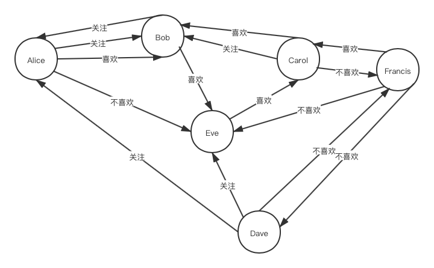

## 目录结构
```
├── include/gstore
│    └── CSR.cpp               // CSR源文件
│    └── CSR.h                 // CSR头文件
│    └── PathQueryHandler.cpp  // 接口源文件
│    └── PathQueryHandler.h    / /接口头文件
├── src
│    └── Demo.cpp              // 示例代码
├── makefile                   // cmake编译文件
├── README.md                  // 说明文档
├── social.png                 // 测试数据拓扑图
```

## 本地编译环境要求

- Linux 或 Ubuntu

- g++ >= 5.4

- cmake >= 3.6


## 本地运行示例

如果想在本地调试代码，需要构建一个简易的图数据，假设图的关系如下图所示：



对应三元组数据如下：

``` SPARQL
<Alice> <关注> <Bob> .
<Alice> <喜欢> <Bob> .
<Alice> <不喜欢> <Eve> .
<Bob> <关注> <Alice> .
<Bob> <喜欢> <Eve> .
<Carol> <关注> <Bob> .
<Carol> <喜欢> <Bob> .
<Carol> <不喜欢> <Francis> .
<Dave> <关注> <Alice> .
<Dave> <关注> <Eve> .
<Dave> <不喜欢> <Francis> .
<Eve> <喜欢> <Carol> .
<Francis> <喜欢> <Carol> .
<Francis> <不喜欢> <Dave> .
<Francis> <不喜欢> <Eve> .
```

构建到gstore中对应的NodeIdex数据如下：

``` C++
Index    IRI
0        <Alice>
1        <Bob>
2        <Eve>
3        <Carol>
4        <Francis>
5        <Dave>

Index    Predicate
0        <关注>
1        <喜欢>
2        <不喜欢>
```

以下代码在PathQueryHandler.cpp文件中，用于初始化CSR数据
```C++
void PathQueryHandler::initQueryUtil() 
{
    // OUT
    csr[0].init(3);
    csr[0].id2vid[0] = {0, 1, 3, 5};
    csr[0].id2vid[1] = {0, 1, 2, 3, 4};
    csr[0].id2vid[2] = {0, 3, 4, 5};
    std::map<unsigned, unsigned> vid2id0;
    std::map<unsigned, unsigned> vid2id1;
    std::map<unsigned, unsigned> vid2id2;
    vid2id0.insert(make_pair(0, 0));
    vid2id0.insert(make_pair(1, 1));
    vid2id0.insert(make_pair(3, 2));
    vid2id0.insert(make_pair(5, 3));
    vid2id1.insert(make_pair(0, 0));
    vid2id1.insert(make_pair(1, 1));
    vid2id1.insert(make_pair(2, 2));
    vid2id1.insert(make_pair(3, 3));
    vid2id1.insert(make_pair(4, 4));
    vid2id2.insert(make_pair(0, 0));
    vid2id2.insert(make_pair(3, 1));
    vid2id2.insert(make_pair(4, 2));
    vid2id2.insert(make_pair(5, 3));
    csr[0].vid2id[0] = vid2id0;
    csr[0].vid2id[1] = vid2id1;
    csr[0].vid2id[2] = vid2id2;
    csr[0].offset_list[0] = {0, 1, 2, 3};
    csr[0].offset_list[1] = {0, 1, 2, 3, 4};
    csr[0].offset_list[2] = {0, 1, 2, 4};
    csr[0].adjacency_list[0] = {1, 0, 1, 0, 2};
    csr[0].adjacency_list[1] = {1, 2, 3, 1, 3};
    csr[0].adjacency_list[2] = {2, 4, 2, 5, 4};

    // IN
    csr[1].init(3);
    csr[1].id2vid[0] = {0, 1, 2};
    csr[1].id2vid[1] = {1, 2, 3};
    csr[1].id2vid[2] = {2, 4, 5};
    std::map<unsigned, unsigned> vid2id3;
    std::map<unsigned, unsigned> vid2id4;
    std::map<unsigned, unsigned> vid2id5;
    vid2id3.insert(make_pair(0, 0));
    vid2id3.insert(make_pair(1, 1));
    vid2id3.insert(make_pair(2, 2));
    vid2id4.insert(make_pair(1, 0));
    vid2id4.insert(make_pair(2, 1));
    vid2id4.insert(make_pair(3, 2));
    vid2id5.insert(make_pair(2, 0));
    vid2id5.insert(make_pair(4, 1));
    vid2id5.insert(make_pair(5, 2));
    csr[1].vid2id[0] = vid2id3;
    csr[1].vid2id[1] = vid2id4;
    csr[1].vid2id[2] = vid2id5;
    csr[1].offset_list[0] = {0, 2, 4};
    csr[1].offset_list[1] = {0, 2, 3};
    csr[1].offset_list[2] = {0, 2, 4};
    csr[1].adjacency_list[0] = {1, 5, 0, 3, 5};
    csr[1].adjacency_list[1] = {0, 3, 1, 2, 4};
    csr[1].adjacency_list[2] = {0, 4, 3, 5, 4};
	csr[1].n = 6;
	csr[1].m = 0;
	for (int i = 0; i < csr[1].pre_num; i++)
		csr[1].m += csr[1].adjacency_list[i].size();
}
```

执行以下脚本可编译demo文件，然后执行
```bash
$ make clean
$ make
$ bin/demo
1,1,2,1,3,1,1
# 以上结果表示<Bob>和<Carol>之间存在一个`喜欢`关系的环路
# 结点
# idx iri
# 1   Bob
# 2   Eve
# 3   Carol
# 谓词
# idx predicate
# 1   喜欢
#  1    1      2     1       3      1       1
# Bob-[喜欢]-> Eve -[喜欢]-> Carol -[喜欢]-> Bob
```

可复制一份src/demo.cpp文件，编写自己的函数实现（记得修改makefile文件）